---

## 概要

主に YukkuriMovieMaker4 向けのプラグインを開発しています。
DirectX 11 と C#、HLSL を用いた映像制作ツールの拡張が主な活動です。
公開しているプラグインの詳細は [ymm4.routersys.com](https://ymm4.routersys.com/) をご覧ください。

---

## 技術

  

---

## 統計

---

## リンク

&nbsp;

&nbsp;

  

